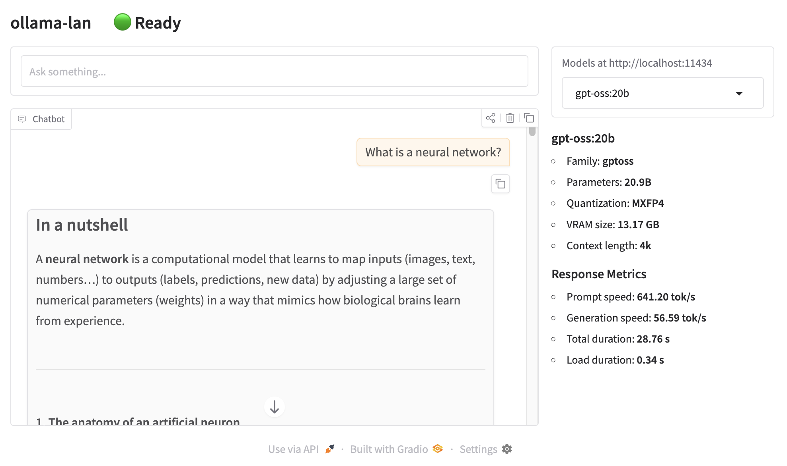

# ollama-lan

Run Ollama on one machine and use it from any device on your local network.

This is a minimal single-file Gradio UI for Ollama, designed to stay readable and easy to modify.



Features:

- Chat conversation UI
- Streaming responses
- Model picker (loaded from `/api/tags`)
- Live status header (`Ready`, `Generating`, `Thinking`, `Ollama unreachable`)
- Model details (family, parameter size, quantization)
- Runtime info (CPU/GPU split, VRAM usage, RAM usage, context length)
- Response metrics (prompt tok/s, generation tok/s, total duration, load duration)
- Chat controls: clear history, copy message, copy full chat

No database. No backend framework. Just Python, Gradio, and Ollama.

---

## Requirements

- Python **3.10+**
- A running **Ollama** instance (default: `http://localhost:11434`)

Test your Ollama first:

```bash
ollama list
```

---

## Quickstart

```bash
git clone https://github.com/philipphenkel/ollama-lan.git
cd ollama-lan

python3 -m venv .venv
source .venv/bin/activate

pip install -r requirements.txt

python ollama-lan.py
```

Then open:

```
http://localhost:11440
```

Default bind: `0.0.0.0:11440`

---

## Linux Install (systemd)

Install via one-liner (downloads from GitHub, installs to `/opt/ollama-lan`, creates a systemd service):

```bash
curl -fsSL https://raw.githubusercontent.com/philipphenkel/ollama-lan/main/scripts/install.sh | bash
```

Customize with environment variables:

```bash
curl -fsSL https://raw.githubusercontent.com/philipphenkel/ollama-lan/main/scripts/install.sh | \
  OLLAMA_LAN_HOST=0.0.0.0 \
  OLLAMA_LAN_BASE_URL=http://192.168.1.20:11434 \
  OLLAMA_LAN_PORT=11440 \
  OLLAMA_LAN_MODEL=gpt-oss:20b \
  bash
```

Supported installer variables:

- `OLLAMA_LAN_REPO` (default: `https://github.com/philipphenkel/ollama-lan`)
- `OLLAMA_LAN_REF` (default: `main`)
- `OLLAMA_LAN_DIR` (default: `/opt/ollama-lan`)
- `OLLAMA_LAN_USER` / `OLLAMA_LAN_GROUP` (default: invoking user)
- `OLLAMA_LAN_HOST` (default: `0.0.0.0`)
- `OLLAMA_LAN_PORT` (default: `11440`)
- `OLLAMA_LAN_BASE_URL` (default: `http://localhost:11434`)
- `OLLAMA_LAN_MODEL` (default: unset)

Uninstall:

```bash
curl -fsSL https://raw.githubusercontent.com/philipphenkel/ollama-lan/main/scripts/uninstall.sh | bash
```

---

## Command Line Options

| Option | Default | Description |
|------|------|------|
| `--host` | `0.0.0.0` | Web server bind address |
| `--port` | `11440` | Web UI port |
| `--ollama-base-url` | `http://localhost:11434` | Ollama API base URL |
| `--model` | first available model | Preselect model at startup |

---

## Examples

Run locally only:

```bash
python ollama-lan.py --host 127.0.0.1 --port 8080
```

Connect to remote Ollama server:

```bash
python ollama-lan.py \
  --ollama-base-url http://192.168.1.20:11434 \
  --model gpt-oss:20b
```

---

## What Makes This Different

This project intentionally avoids:

- databases
- auth layers
- async frameworks
- heavy frontends

The goal is a **debuggable, hackable reference UI** you can read in one sitting and modify easily.

## License

MIT
